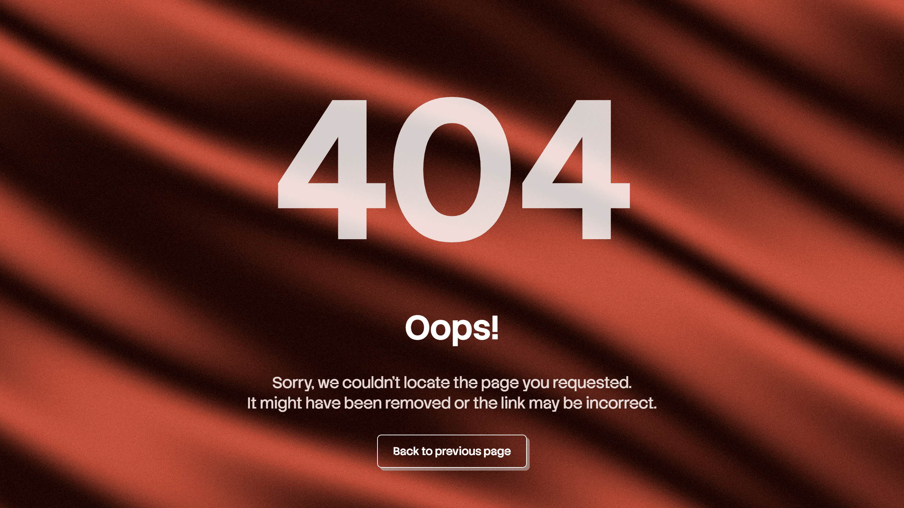
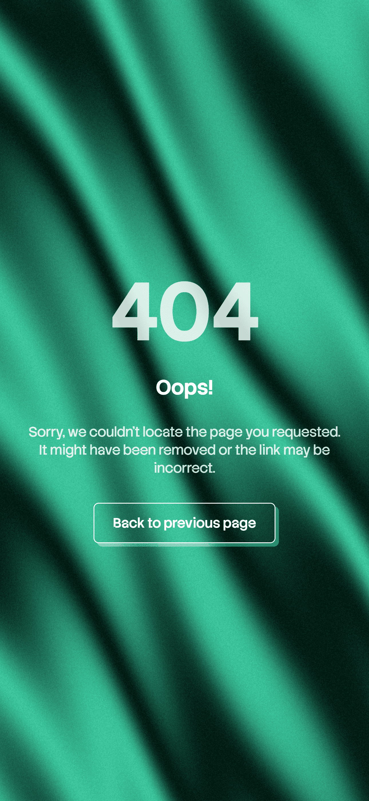
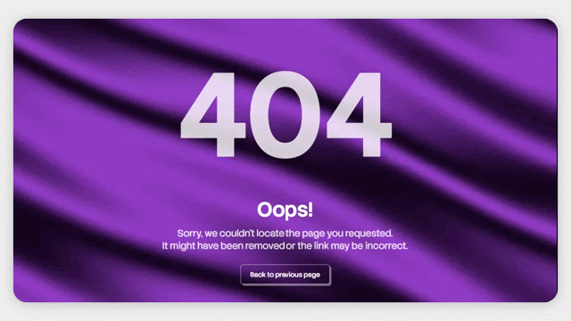

  

<h1 align="center"><a href="https://notfoundpages.github.io/404-animated-silk-bg-three-js">404-animated-silk-bg-three-js</a></h1>

  A beautiful 404 error page featuring a flowing animated silk background,
  generative WebGL visuals, and a clean, minimal interface.

<h3 align="center">
  <a href="https://notfoundpages.github.io/404-animated-silk-bg-three-js">Live Demo</a>
  ·
  <a href="https://github.com/notfoundpages/404-animated-silk-bg-three-js">Source Code</a>
  ·
  <a href="https://github.com/notfoundpages/404-animated-silk-bg-three-js/issues">Issues</a>
</h3>

## Overview

A 404 page doesn't have to feel like an error.

**404 Animated Silk Background Three.js** transforms the familiar "page not found" experience into a smooth, generative visual experience. It combines a continuously animated silk-like background with a simple 404 interface, creating a subtle and immersive error page.

Built with **HTML, CSS, vanilla JavaScript, and Three.js**, the page uses WebGL shaders to generate the animated background in real time. It requires no build step and keeps the interface simple and easy to customize.

Just copy it into your project, customize it, and give your visitors something more memorable than a standard error page.

## Preview

| Desktop | Mobile |
| ------- | ------ |
|  |  |

<table width="100%">
  <tr>
    <td width="50%" align="left" valign="middle">
      
    </td>
    <td width="50%" align="left" valign="middle">
      The background is powered by a WebGL shader running through
      <b>Three.js</b>. The shader generates continuously moving silk-like
      patterns with smooth gradients, subtle noise, and an automatically
      changing color palette.
    </td>
  </tr>
</table>

## Quick Start

### GitHub Pages

Using it with **GitHub Pages** is simple:

1. Rename `index.html` to `404.html`.
2. Keep `404.html` in the **root** of your repository.
3. If using the external version, keep `style.css` and `script.js` alongside it.
4. Commit and push your changes.

GitHub Pages automatically serves a root-level `404.html` when a visitor reaches a page that doesn't exist.

### Other Hosting

For other hosting platforms, rename `index.html` to `404.html` and upload it to your website's public or root directory.

If you're using the external version, upload `style.css` and `script.js` alongside it.

Most hosting platforms automatically serve `404.html` for missing pages. If yours requires additional configuration, check your hosting provider's documentation for setting a custom 404 page.

### Inline Version

Prefer a single file? Use either `inline/index.html` or the minified `inline/index.min.html`.

Simply copy the contents into a new `404.html` in your repository or hosting root and you're ready to go – no external CSS, JavaScript, or assets required.

  <strong>Made with ❤️ by <a href="https://notfoundpages.github.io">Not Found Pages</a></strong>

  Give your visitors something better than a dead end.

